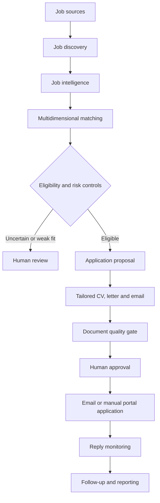

# HR Hunter

**Human-in-the-loop AI recruitment and job application workflow**

HR Hunter is an AI-assisted workflow built to turn a fragmented job-search process into a controlled end-to-end application pipeline. It combines job discovery, structured job intelligence, multidimensional candidate matching, source-grounded document generation, quality controls, human approval, sending and follow-up.

> Portfolio note: this repository documents a sanitized version of a working personal project. Candidate data, credentials, operational databases, logs and real application outputs are intentionally excluded.

## Why I built it

Job applications involve more than finding vacancies. A useful system must decide whether an opportunity is genuinely relevant, avoid overrating senior roles, preserve the truth of the candidate's experience, tailor documents without inventing facts, and keep a human in control before external actions.

I designed HR Hunter around those business constraints rather than around autonomous application volume.

## Workflow

## What the implementation covers

- job discovery from configured sources and target companies
- analysis of role family, seniority, languages, education and other requirements
- multidimensional fit scoring with explicit scoring rules
- seniority and risk controls before an application is proposed
- a human-review queue for uncertain decisions
- tailored CV, cover-letter and application-email generation
- document quality validation against source candidate information
- recruiter/contact selection support
- Gmail sending and inbox monitoring
- Telegram proposals, approvals and status interactions
- application status, follow-up and daily reporting workflows
- local persistence and scheduled/background execution
- automated quality and candidate-generation tests

## Product principles

**Fit before volume.** A high apparent keyword match should not override a material seniority or mandatory-requirement gap.

**Source-grounded generation.** Tailoring should reframe real experience, not create experience the candidate does not have.

**Human control at consequential steps.** The system can recommend and prepare, but ambiguous matches and external actions remain reviewable.

**Quality gates before automation.** Generated documents are checked before they enter the sending workflow.

**Operational traceability.** Applications, decisions, replies and follow-ups are treated as stateful workflow events rather than isolated prompts.

## Architecture

The project is primarily Python and uses configuration-driven rules, local persistence, document-generation utilities and external communication integrations. Key modules separate discovery, job analysis, scoring, workflow decisions, document generation, document QA, approvals, messaging and reporting.

See [Architecture](docs/ARCHITECTURE.md), [Business & Product Decisions](docs/BUSINESS_PRODUCT_DECISIONS.md) and [Security](SECURITY.md).

## My role

I defined the business problem, workflow, matching constraints, approval logic, quality expectations and product iterations, and built the working prototype through AI-assisted development. The project reflects my approach to AI business solutions: translate an operational problem into explicit decision rules, prototype the workflow, integrate the required systems, test failure cases and keep human control where mistakes have real consequences.

This project is not presented as evidence that I am a traditional software or ML engineer. It is evidence of hands-on AI solution design, prototyping, workflow automation and technical collaboration.

## Limitations

- job-source availability and HTML structures can change
- scoring is decision support, not an objective measure of candidate quality
- generated documents require human validation
- external integrations depend on their respective accounts and configuration
- no ATS score or hiring outcome can be guaranteed

## Portfolio status

The original operational environment contains private candidate and application data and is not published. This repository is being prepared as a sanitized portfolio representation with no secrets, real candidate profile, operational database, logs or historical application documents.

## Portfolio walkthrough

The portfolio presentation uses the real interaction surfaces of the workflow rather than inventing a separate dashboard:

1. **Telegram decision support**: job opportunity, multidimensional match, reasons, risks and the next human action.
2. **Application execution**: a personalized application prepared for external communication, with private candidate details anonymized in the portfolio.

## What to discuss in an interview

The strongest design choice is the separation between recommendation and consequential action. The workflow can discover, analyze, score and prepare, but uncertainty is surfaced and human approval remains part of the process. This is especially important when AI-generated output can affect a real candidate.
