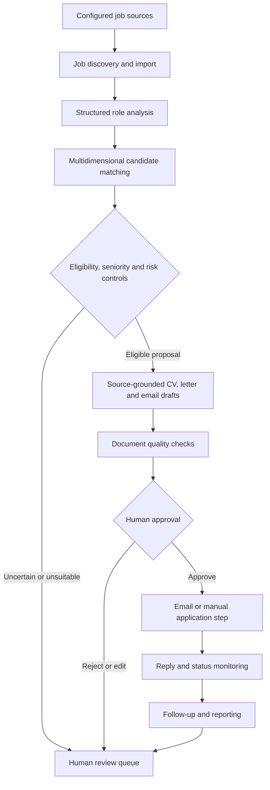

# HR Hunter — Architecture

This diagram describes the portfolio snapshot's decision-support workflow. It does not imply autonomous hiring or application submission.

## Boundaries and controls

- Matching and scoring support review; they do not determine a person's employment outcome.
- Generated application material must remain grounded in candidate-provided facts and be reviewed before use.
- Human approval precedes consequential external communication.
- The portfolio snapshot excludes real candidate profiles, CVs, application outputs, credentials, databases, logs and message history.

## Components

The Python implementation separates discovery and job analysis, matching rules, document generation, quality checks, approval interactions, messaging, persistence and scheduled workflow execution. Integrations depend on locally supplied configuration and third-party accounts.
